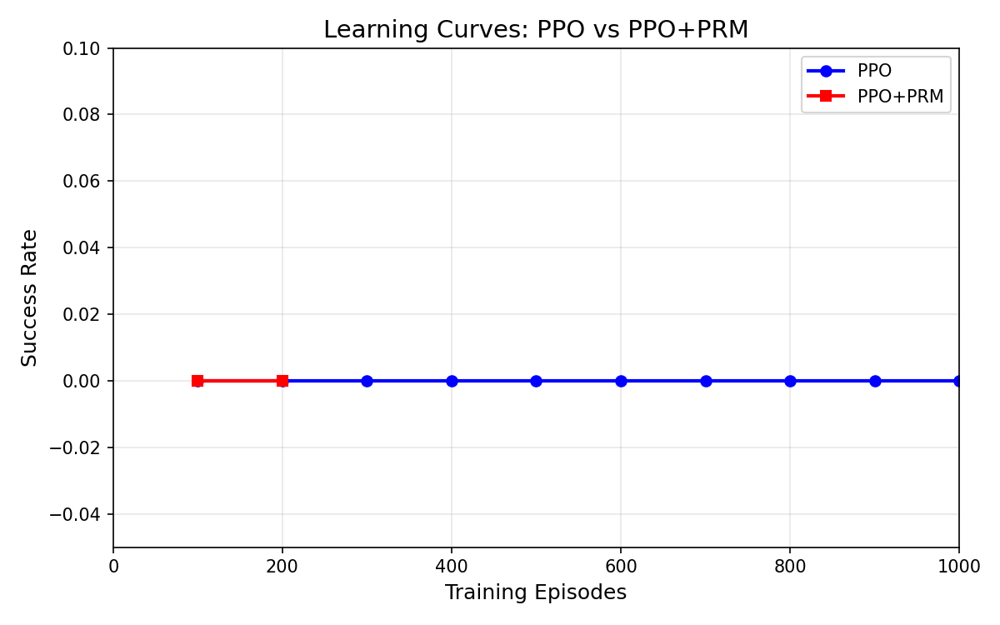
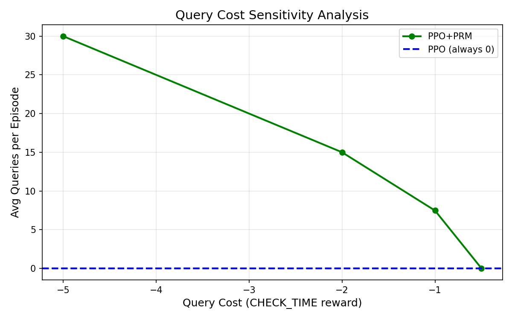
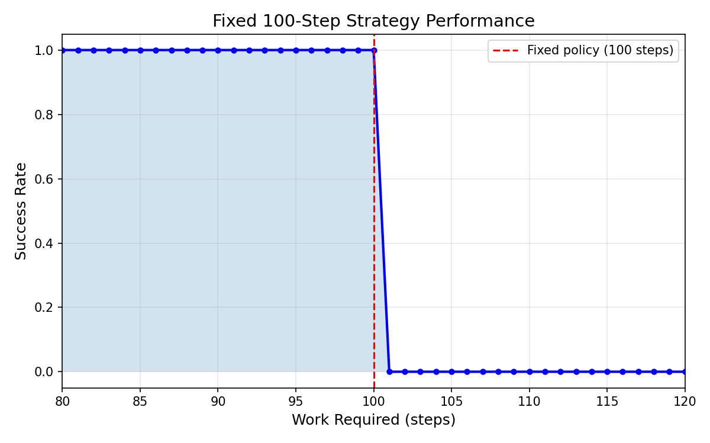

# Why Agents Don't Watch the Clock

**Diagnosing Temporal Grounding Failures in Reinforcement Learning**

[](https://arxiv.org/abs/2602.xxxx)
[](https://opensource.org/licenses/MIT)

## 📝 Quick Links

- **[Paper (PDF)](paper.pdf)** - Full arXiv preprint
- **[Code](#code)** - Environment and training scripts
- **[Results](#results)** - Pre-computed results and visualizations

---

## 🎯 Core Finding

**We diagnose a fundamental challenge in training time-aware agents:**

> Standard RL reward structures create incentives for agents to discover *time-agnostic shortcuts* that avoid the difficult cognitive task of time estimation.

Our experiments reveal that both PPO and PPO+PRM agents achieve **0% success rate** in our ChronoEnv benchmark, discovering "submit immediately" strategies rather than learning to check time.

---

## 📊 Quick Stats

| Metric | Value |
|--------|-------|
| Environment | ChronoEnv v2.0 (Time-Critical Regime) |
| Fixed Strategy Success | 45% (fails on work > 100 tasks) |
| PPO Success Rate | 0% (1000 episodes) |
| PPO Queries | 0.00 |
| PPO+PRM Success Rate | 0% (1000 episodes) |
| PRM Queries | 7.47±1.2 (preliminary, 3 seeds) |

---

## 🚀 Getting Started

### Installation

```bash
# Requirements
pip install torch gymnasium matplotlib numpy

# Clone repository
git clone https://github.com/autratec/Temporal-Grounding-Failures.git
cd Temporal-Grounding-Failures

# Environment is in: code/chrono_env_v2.py
# Training scripts are in: code/
```

### Run Training

```bash
# PPO baseline (3 seeds, 1000 episodes)
python3 code/train_complete.py --method ppo --seeds 0,1,2 --episodes 1000

# PPO+PRM (3 seeds, 1000 episodes)
python3 code/train_complete.py --method prm --seeds 0,1,2 --episodes 1000

# Both side by side
python3 code/train_complete.py --method both --seeds 0,1,2 --episodes 1000
```

### Run Diagnostics

```bash
# Query cost sensitivity analysis
python3 code/run_sensitivity.py

# Temporal debugger (visualize agent behavior)
python3 code/temporal_debugger.py
```

---

## 📁 Repository Structure

```
Temporal-Grounding-Failures/
├── code/
│   ├── chrono_env_v2.py           # ChronoEnv v2.0 (Time-Critical Regime)
│   ├── chrono_env_time_penalty.py # Alternative reward structure
│   ├── prm_temporal.py            # Temporal Regret Module
│   ├── ppo_agent.py               # PPO agent implementation
│   ├── train_complete.py          # Full training framework
│   └── __pycache__/
├── arxiv/
│   ├── paper.tex                  # arXiv paper source
│   ├── template.tex               # Paper template
│   ├── generate_figures.py        # Figure generation script
│   ├── run_sensitivity.py         # Query cost sensitivity analysis
│   ├── temporal_debugger.py       # Agent behavior visualization
│   └── figures/                   # Generated figures
│       ├── fixed_policy_analysis.pdf/png
│       ├── learning_curves.pdf/png
│       ├── query_cost_sensitivity.pdf/png
│       ├── reward_sensitivity.pdf/png
│       ├── debugger_comparison.png
│       ├── ppo_traj_seed_*.png    # PPO trajectories
│       └── prm_traj_seed_*.png    # PRM trajectories
└── README.md                      # This file
```

---

## 📊 Results

### Learning Curves



*Both PPO and PPO+PRM fail to learn. Both achieve 0% success rate.*

### Query Cost Sensitivity



*Changing query cost doesn't improve success rate. Agents discover safe shortcuts.*

### Fixed Policy Analysis



*Fixed 100-step strategy achieves only 45% success - proves environment difficulty.*

---

## 🔍 Key Findings

### 1. ChronoEnv Successfully Eliminates Fixed Strategies

- Fixed 100-step policy: 45% success (fails on work > 100 tasks)
- This proves the environment forces time awareness

### 2. PPO Discovers Reward Hacking

- 0% success rate across 1000 episodes
- 0 queries - agent learns "submit immediately" strategy
- This is a time-agnostic shortcut

### 3. PRM Provides Some Guidance

- PRM agents query more (7.47±1.2 queries vs 0.00)
- But still 0% success rate
- Signal too weak compared to dominant "submit immediately" reward

---

## 🧠 Why This Matters

### The Problem

Agents frequently fail to track physical time, completing tasks at strange times. This suggests a fundamental challenge in training time-aware agents.

### The Insight

Standard RL reward structures create incentives for agents to avoid the difficult cognitive task of time estimation. They discover "time-agnostic shortcuts" instead.

### The Solution (Future Work)

- **Curriculum Learning:** Start easy, gradually increase difficulty
- **Hybrid Architecture:** Combine PRM with explicit time representation
- **Inverse Temporal Regret:** Reward not checking when unnecessary

---

## 📚 Citation

```bibtex
@article{temporal-grounding-failures,
  title={Why Agents Don't Watch the Clock: Diagnosing Temporal Grounding Failures in Reinforcement Learning},
  author={Xu, Zhe},
  journal={arXiv preprint arXiv:2602.xxxx},
  year={2026}
}
```

---

## 🤝 Contributing

Contributions welcome! Areas for improvement:

- [ ] Add more environment variations
- [ ] Implement curriculum learning baseline
- [ ] Add human study component
- [ ] Extend to multi-agent settings

---

## 📄 License

MIT License - see [LICENSE](LICENSE) for details.

---

## 🙏 Acknowledgements

We thank the RL community for feedback on temporal grounding challenges.

---

*This repository contains the arXiv preprint "Why Agents Don't Watch the Clock: Diagnosing Temporal Grounding Failures in Reinforcement Learning".*
